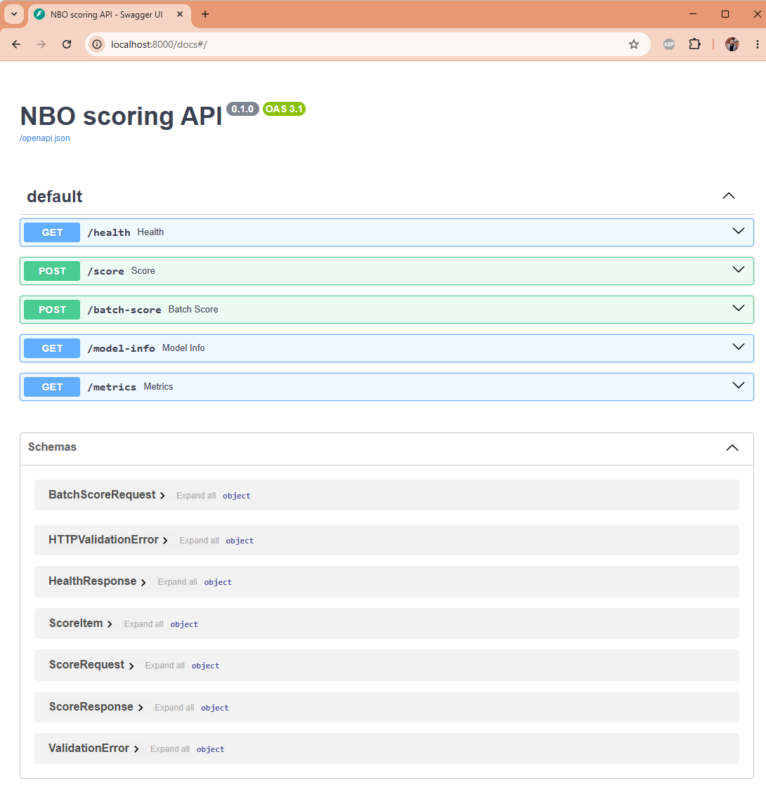
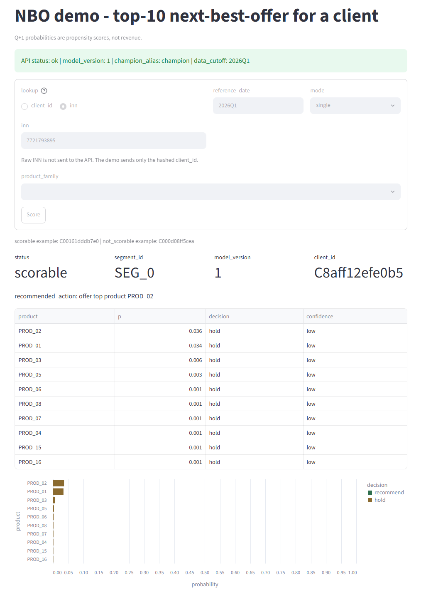
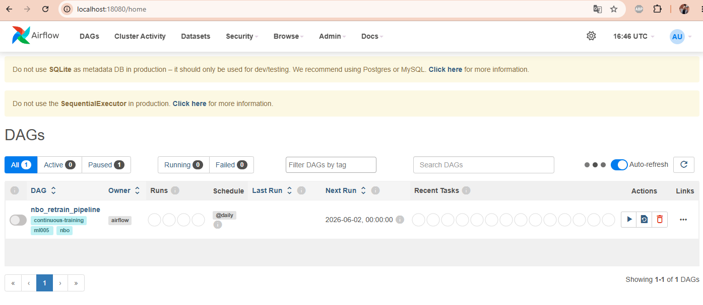
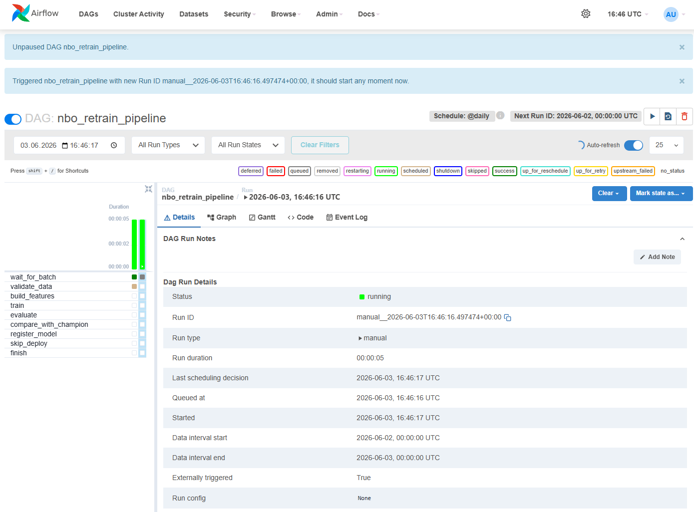
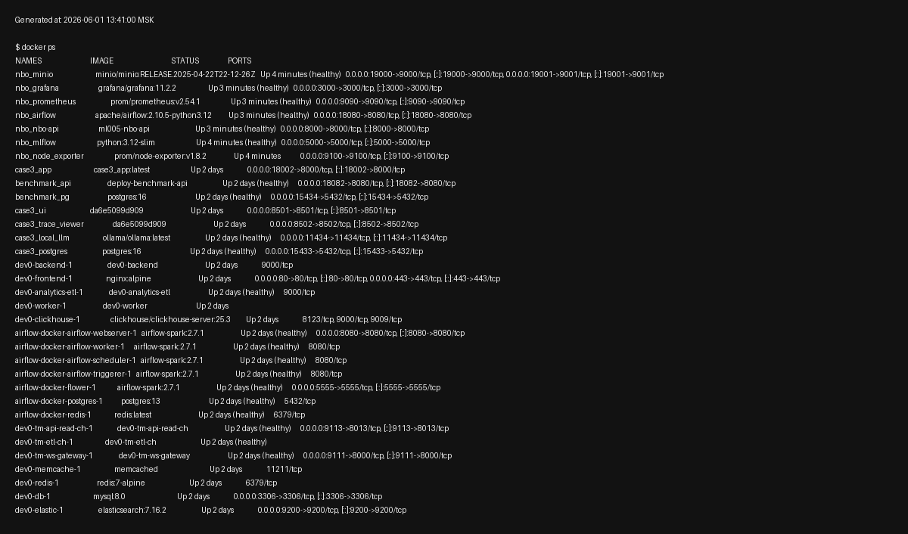
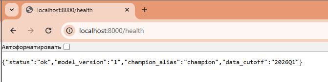
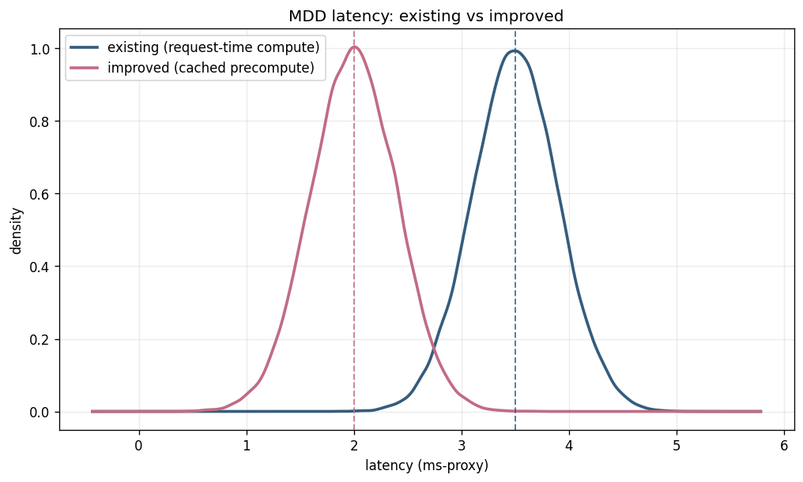

# ML Ops final - сервис next-best-offer (NBO)

финальный проект по курсу "развертывание ml-моделей".

за основу взял рабочую идею из продуктовой аналитики: рекомендация продуктов клиенту по истории. вокруг нее собран mlops-контур уровня 2 по требованиям дз: данные -> фичи -> обучение -> оценка -> registry -> сервинг -> мониторинг.

домен обезличенный: вендор b2b-софта (продажи / продления лицензий). задача: по клиенту (`client_id`) на дату вернуть топ-10 продуктов, которые он скорее всего купит / продлит в следующем квартале (Q+1).

> ## навигация по проекту
>
> 1. **[манифест проекта](manifest.md)** - главный документ: зачем система, что делает, как устроена, какой уровень зрелости (Level 2) заявлен
> 2. **[о модели](docs/upstream_real_project.md)** - откуда взялась модель: реальный рабочий проект, сегментация клиентской базы, 3d-карта сегментов
> 3. **[скриншоты локального запуска](screenshots/README.md)** - все части системы в работе, в картинках
> 4. **[требования к работе](#требования-к-работе)** - сверка по 5 критериям оценки с доказательствами:
>     1. постановка цели (бизнес-метрика)
>     2. уровень зрелости Level 2
>     3. создание ML-системы
>     4. управление рисками (SLI/SLO)
>     5. MDD / ADR

ниже - техническая часть.

---

## про данные и модель

саму обученную модель и реальные данные в репозиторий положить нельзя. поэтому в git уходит только синтетика + код, а работу сервиса показываю на localhost-evidence.

- в репо лежит маленький синтетический сэмпл [data/sample_synth.parquet](data/sample_synth.parquet), на нем все крутится локально / в ci.
- реальные parquet / `model.pkl` / `mlruns` / `.env` держу на localhost, закрыты через [.gitignore](.gitignore).
- обезличивание: продукты = `PROD_01..PROD_39`, сегменты = `SEG_0..SEG_6`, клиент = `client_id` (хэш, не инн).
- свой `make leak-check` гоняю перед пушем: проверяет gitignore-гейты + ищет в файлах id-подобные номера / сырые имена продуктов.

---

## структура

```text
ml005/
|-- README.md
|-- manifest.md
|-- requirements.txt
|-- docker-compose.yml        # полный стек: mlflow / nbo-api / airflow / prometheus / grafana / node-exporter / minio
|-- Dockerfile                # образ nbo-api
|-- Makefile                  # data / test / up / down / leak-check
|-- .env.example
|-- .github/workflows/ci.yml  # ci: checks (compile + smoke) + terraform
|-- src/
|   |-- gen_synthetic.py      # генератор синтетики (для git/ci)
|   |-- data_wrappers.py      # доступ к локальным данным (реальные - вне git)
|   |-- features.py           # pit-safe фичи + feature store
|   |-- labels.py             # таргет на Q+1
|   |-- train.py              # champion (popularity) + challenger (supervised)
|   |-- evaluate.py           # офлайн-метрики на holdout
|   |-- registry.py           # mlflow alias champion/challenger
|   `-- serve_api.py          # fastapi /health /score /batch-score /model-info /metrics
|-- dags/
|   `-- nbo_retrain_dag.py    # airflow: sensor -> validate -> train -> evaluate -> gate -> promote/skip
|-- infra/                    # terraform (local provider) + cloud-заглушка
|-- monitoring/               # prometheus.yml / grafana provisioning / evidently drift
|-- artifacts/
|   `-- feature_list.json     # контракт фич (порядок + hash), общий для train/serve
|-- notebooks/
|   |-- HW_Design.ipynb       # финальный design-notebook для сдачи
|   `-- mdd_latency.ipynb     # mdd по latency
|-- adr/0001-latency-mdd-decision.md
|-- docs/sli_slo.md           # sli/slo на 3 уровнях
|-- reports/                  # верификационные логи + метрики + terraform planы (без реальных данных)
|-- tests/                    # pytest (features / eval / registry / api / dag / drift)
|-- data/                     # только sample_synth.parquet (синтетика)
`-- screenshots/              # evidence-скрины / render / index
```

---

## бизнес-задача + метрика

- по клиенту отдаю топ-10 продуктов с вероятностью покупки / продления в Q+1.
- ранжирую на уровне продукта (~39 штук). на уровне семейства их всего 6 + один доминирует ~85%, "топ-10" там вырождается в одно популярное.
- главная бизнес-метрика: **hit-rate@10** (доля клиентов, у кого хотя бы 1 из топ-10 реально сбылась в Q+1).
- ml-прокси к ней: precision@10 / recall@10 / map@10 / ndcg@10 + uplift над popularity-бейзлайном.
- ранжирую по вероятности. денежные поля - это прокси, не реальная выручка, за выручку их нигде не выдаю.

---

## пайплайн

```text
events -> features (pit cutoff) -> train: champion + challenger -> evaluate (holdout Q_t+1) -> registry (alias)
```

### фичи

- ключ строки = (`client_id`, `quarter`).
- фичи считаются строго до конца квартала (point-in-time), будущее в фичи не течет (есть тест на это).
- порядок и набор фич зафиксирован в `feature_list.json` + schema-hash. этот hash один на проект, его же сверяет сервинг (parity train/serve).

### обучение: champion + challenger

- champion = popularity + сегментный приор (со сглаживанием) + co-occurrence. простой объяснимый бейзлайн.
- challenger = supervised multi-label, старт logreg one-vs-rest, цель lightgbm (per-product, с балансом классов).
- temporal split: учу на кварталах <= Q_t, проверяю на Q_t+1. сид фиксирован, воспроизводимо.
- строки без инн / pseudo-инн из обучения выкидываю (помечаю not_scorable).
- gate (регистрировать новую модель или нет) живет в dag. train сам по себе только обучает + считает sanity-метрики.

### оценка

- метрики на honest holdout (Q_t+1): precision@10 / recall@10 / map@10 / ndcg@10 / hit-rate@10 + per-product auc.
- challenger сравниваю с champion, считаю uplift (абсолютный + относительный).
- отчеты: [reports/metric_report.md](reports/metric_report.md) (человеку) + [reports/metric_report.json](reports/metric_report.json) (для gate).
- на синтетике сигнал слабый, поэтому абсолютные числа маленькие. синтетика нужна только чтобы пайплайн крутился, на реальных данных метрики другие.

### mlflow registry

- модель версионируется в mlflow, переключение champion/challenger через alias (без хардкода версий).
- `promote(version)` выводит в прод (после gate), `rollback()` откатывает на прошлую версию. это и есть "вывод плохой модели через переключение трафика".
- байты модели лежат локально (`model.pkl`, вне git), registry хранит версию / hash / метрики / alias.

запуск mlflow локально:

```bash
docker compose up -d mlflow
# ui: http://localhost:5000
python -m src.registry --show
```

### сервинг (api)

fastapi-сервис поверх champion-модели (читается по mlflow alias, без хардкода версии).

- `GET /health` - статус, версия модели, data_cutoff.
- `POST /score` - по client_id на дату отдает топ-10 продуктов `{product, p, decision, confidence}` + caveats.
- `POST /batch-score` - то же списком.
- `GET /model-info` - версия / метрики / feature_list_hash.
- `GET /metrics` - prometheus-формат (latency, число запросов, ошибки, распределение score).
- parity: фичи считаю тем же кодом и тем же feature_list.json, что train. в request-path нет похода за свежими данными (тяжелый расчет вынесен в feature store).
- честный not_scorable: клиент без инн / без записи -> score=null, без выдуманного топ-10.

```bash
docker compose up -d --build nbo-api   # http://localhost:8000/health
```

### переобучение (airflow dag)

`nbo_retrain_pipeline` - континуальное переобучение с гейтом по метрике (это и есть "вывод плохой модели через переключение трафика").

- цепочка: `wait_for_batch` (file/s3 sensor) -> `validate_data` -> `build_features` -> `train` -> `evaluate` -> `compare_with_champion` -> `register_model` / `skip_deploy` -> `finish`.
- gate: `precision@10_new >= champion и >= порога` -> регистрируем + промоутим challenger в champion (alias-switch). иначе skip, champion не трогаем.
- validate реально падает (raise) на битой схеме / null / out-of-range, не пускает обучение дальше.
- обучение живет только в dag, не в ci.
- dag парсится и без установленного airflow (shim), чтобы ci/тесты не тянули airflow и не запускали обучение.

```bash
docker compose up -d airflow   # ui http://localhost:8080
```

### мониторинг (prometheus + grafana + evidently)

- prometheus скрейпит `nbo-api:8000/metrics` + node-exporter, держит alert-правила (p95 latency, error-rate).
- grafana авто-провижинит дашборд `nbo_overview`: p95/p99 latency, error-rate, rps, drift share.
- evidently/drift: считаю data drift + psi на выходах пайплайна, пишу html-отчет + `nbo_drift.prom` для node-exporter (живая drift-метрика). вызывается standalone и шагом из dag.
- sli/slo на 3 уровнях (технический / модель-данные / бизнес) с порогами и incident-action: [docs/sli_slo.md](docs/sli_slo.md). числовые пороги помечены [assumption] до калибровки на baseline.

```bash
docker compose up -d prometheus grafana node-exporter   # grafana http://localhost:3000 (admin/admin), prometheus http://localhost:9090
```

### инфра / ci (terraform + github actions)

- весь стек поднимается одной командой `docker compose up -d` (mlflow, nbo-api, airflow, prometheus, grafana, node-exporter, minio) - у сервисов healthcheck, `docker ps` -> Up (healthy).
- terraform (local provider) держит декларативные манифесты стека: storage / mlflow / airflow / api / pipeline-contract. `terraform plan` -> 5 to add; planы сохранены в [reports/terraform_plan.txt](reports/terraform_plan.txt) + destroy-план.
- ci (github actions): job checks (compile + smoke-тесты на синтетике) + job terraform (fmt / validate / plan). обучение в ci не гоняется - это работа dag.

```bash
cd infra && terraform init && terraform validate && terraform plan
```

---

## эндпоинты

| endpoint | зачем |
|---|---|
| `GET /health` | жив ли сервис + какая версия champion |
| `POST /score` | top-10 по одному `client_id` |
| `POST /batch-score` | top-10 по списку клиентов |
| `GET /model-info` | версия / метрики / `feature_list_hash` |
| `GET /metrics` | prometheus scrape |

пример `/score`:

```json
{"client_id":"C0004e3cbdfb8","reference_date":"2026Q1","mode":"single"}
```

ответ содержит:

```text
client_id / model_version / segment_id / status / score / recommended_action / caveats
```

если клиент `not_scorable`, то `score=null`. фейковый top-10 не рисую.

---

## порты

дефолты из [.env.example](.env.example):

| сервис | порт |
|---|---:|
| nbo-api | `8000` |
| mlflow | `5000` |
| airflow | `8080` |
| prometheus | `9090` |
| grafana | `3000` |
| demo ui | `18501` |
| demo health | `18502` |

---

## Требования к работе

работа оценивается по 5 критериям. по каждому ниже: что требуется по заданию, что я сделал, и доказательство (документ или скриншот). сводная таблица соответствия - в [reports/rubric_mapping.md](reports/rubric_mapping.md).

### 1. постановка цели (критерий C1)

в работе требуется выбрать верную бизнес-метрику и под нее верные метрики ML-проектирования.

я выбрал главной бизнес-метрикой **hit-rate@10** - долю клиентов, у которых хотя бы один из 10 предложенных продуктов реально сбылся в следующем квартале. она прямо измеряет пользу для продаж. под ней идут модельные метрики precision@10 / recall@10 / map@10 / ndcg@10 и per-product auc, выстроено метрик-дерево (бизнес -> модель -> технические). разбор - в [манифесте](manifest.md), разделы 7-8; посчитанные числа - в [reports/metric_report.md](reports/metric_report.md).

как доказательство, что сервис реально отдает топ-10 по клиенту.

контракт API (`/score`, `/health`, `/model-info`, `/metrics`):



demo: ввел клиента, получил топ-10 продуктов с вероятностью:



### 2. уровень зрелости Level 2 (критерий C2)

в работе требуется задокументировать и показать работающим полный жизненный цикл модели, включая вывод плохой модели из эксплуатации через переключение трафика, и заявить уровень зрелости.

я заявил **Level 2** и собрал его: модель версионируется в mlflow, рабочая версия и кандидат переключаются через alias; airflow-dag сам переобучает и через гейт решает, выпускать кандидата или оставить текущую модель; собран полный цикл данные -> обучение -> оценка -> registry -> сервинг -> мониторинг. описание - в [манифесте](manifest.md), раздел 4; механика alias / promote / rollback - в [reports/registry_demo.md](reports/registry_demo.md).

как доказательство - airflow-dag переобучения:



прогон dag со всеми задачами; ветка `compare_with_champion -> register_model / skip_deploy` - это и есть автоматический вывод плохой модели через переключение трафика:



### 3. создание ML-системы (критерий C3)

в работе требуется реализовать систему через IaC, чтобы все компоненты работали: для backend показать `docker ps` со статусом Up(healthy), для frontend - доступный `/health` с кодом 200.

я подготовил инфраструктуру как код (terraform, local provider) и ci/cd (github actions); весь стек поднимается одной командой `docker compose up -d`, у сервисов настроены healthcheck. terraform-план - в [reports/terraform_plan.txt](reports/terraform_plan.txt).

как доказательство - `docker ps`, сервисы Up(healthy):



`/health` отвечает 200:



### 4. управление рисками (критерий C4)

в работе требуется сформулировать SLI на трех уровнях (технический, модельный, бизнес) и задать критические пороги SLO.

я подготовил это документом [docs/sli_slo.md](docs/sli_slo.md): все три уровня, у каждого показателя норма / тревога / авария, действие при срабатывании и источник метрики (prometheus / evidently / состояние dag). сбор метрик - prometheus + grafana + evidently (дрейф данных), конфиги в [monitoring/](monitoring/).

### 5. принятие решений по MDD (критерий C5)

в работе требуется применить MDD и оформить решение в формате ADR: гипотезы H0/H1, статистический тест, p-value, уровень значимости и итоговое архитектурное решение.

я подготовил ADR [adr/0001-latency-mdd-decision.md](adr/0001-latency-mdd-decision.md): сравнил два распределения времени ответа, сформулировал H0/H1, прогнал welch t-test и тест манна-уитни, взял alpha 0.05; p-value практически ноль, H0 отклонена; решение - вынести тяжелый расчет в batch + кэш. сам расчет - в [reports/mdd_test_result.md](reports/mdd_test_result.md) и [notebooks/mdd_latency.ipynb](notebooks/mdd_latency.ipynb).

как доказательство - распределения времени ответа (текущая схема и улучшенная с кэшом):



---

## скриншоты локального запуска

все части системы в работе (с описанием и привязкой к критериям) - в галерее: **[screenshots/README.md](screenshots/README.md)**. там docker ps healthy, `/health` 200, swagger, demo топ-10, airflow dag и прогон. полный каталог evidence (с текстовыми логами) - [screenshots/INDEX.md](screenshots/INDEX.md).

---

## mdd / adr (про скорость ответа сервиса)

решение про скорость ответа сервиса принимал по статистике на реальных замерах - это и есть подход metrics-driven development (mdd).

проверял такую идею: если тяжелый расчет признаков считать заранее, пакетно, и складывать в кэш, станет ли сервис отвечать заметно быстрее. для этого сравнил два набора замеров времени ответа: старая схема (считаем прямо в запросе) и улучшенная (берем готовое из кэша).

- **гипотеза.** H0 (нулевая, "ничего не изменилось"): улучшенная схема не быстрее. H1: улучшенная быстрее.
- **как проверял.** статистический тест на разницу скоростей (welch t-test), плюс тест манна-уитни как подстраховка - он не зависит от формы распределения. порог значимости alpha = 0.05 (стандартный: рискуем ошибиться не больше чем в 5% случаев).
- **результат.** p-value (вероятность, что разницу мы увидели случайно) - практически ноль, намного меньше 0.05. значит разница не случайна, нулевую гипотезу отклоняю: улучшенная схема действительно быстрее.
- **решение.** тяжелый расчет признаков выношу в пакетную обработку + кэш (feature store), а api отдает уже посчитанный топ-10. так держу время ответа `/score` в пределах p95 < 500 мс (95% запросов укладываются в полсекунды). решение зафиксировано в adr.

файлы: [reports/mdd_test_result.md](reports/mdd_test_result.md), [reports/mdd_latency_distribution.png](reports/mdd_latency_distribution.png), [adr/0001-latency-mdd-decision.md](adr/0001-latency-mdd-decision.md).

сами большие csv с замерами (по 500 тыс. строк) в git не кладу, они пересоздаются ноутбуком.

---

## sli/slo (показатели здоровья и пороги)

sli (service level indicator) - это показатель, по которому видно, в порядке ли система. slo (service level objective) - целевые границы для этого показателя: что считаем нормой, что тревогой, что аварией. слежу за показателями на трех уровнях: технический (быстро ли и без ошибок отвечает сервис), модельный (не деградирует ли качество модели и данных), бизнес (приносит ли система пользу продажам).

краткая выжимка:

| уровень | показатель | норма | критично |
|---|---|---|---|
| технический | время ответа `/score` (95% запросов) | `< 500 мс` | `> 800 мс` |
| технический | доступность `/health` | `>= 99%` | `< 97%` |
| модель/данные | точность топ-10 vs текущая модель | `>= текущей + запас` | `< текущей` |
| модель/данные | дрейф данных | ниже порога | выше 2x порога |
| бизнес | hit-rate@10 (доля удачных рекомендаций) | `>= базового уровня` | `-25%` |

это короткая версия. полная таблица на трех уровнях, с пояснением каждого показателя, откуда он берется и что делать при срабатывании - в [docs/sli_slo.md](docs/sli_slo.md). конкретные числовые пороги помечены как предварительные: их финально откалибруют после первого боевого прогона.

---

## как запустить локально

```bash
# окружение
python3 -m venv .venv
.venv/bin/pip install -r requirements.txt

# синтетические данные
make data

# тесты
.venv/bin/python -m pytest -q

# проверка на утечку
make leak-check

# обучить (на синтетике)
.venv/bin/python -m src.train --quarter 2021Q4

# офлайн-оценка
.venv/bin/python -m src.evaluate

# полный стек
make up
```
