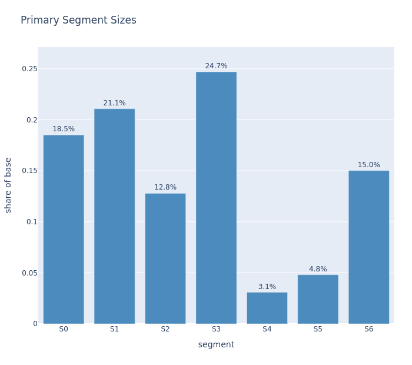
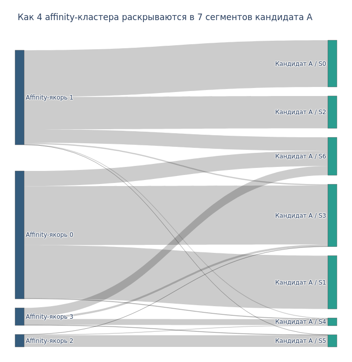
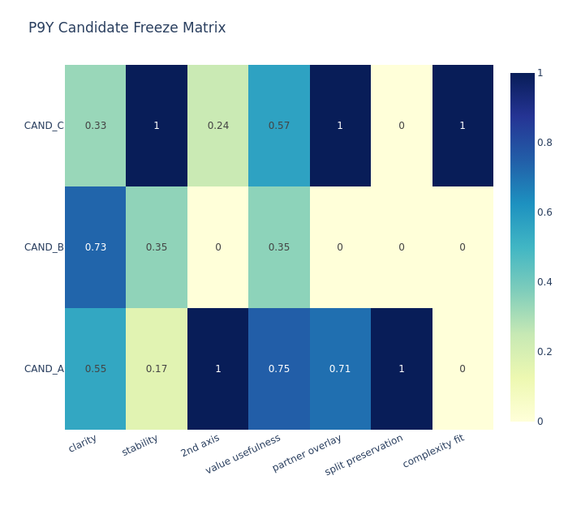

# Откуда взялась модель: реальный проект на работе (обезличенно)

Этот сервис рекомендаций (NBO) я собрал для финального задания не на пустом месте. Перед ним я на работе, на реальных данных, построил слой клиентской аналитики, на котором NBO и стоит. Здесь коротко: что это за слой, какие были цели, как я разбивал клиентов и что получилось. Все обезличено: без названия компании, без ИНН, без реальных имен продуктов. Сегменты обозначены кодами S0..S6, продукты в публичной версии - PROD_xx.

Слой состоит из двух связанных проектов: сегментация клиентов и иерархическая субсегментация. NBO использует их выход как готовый признак.

---

## 1. Сегментация клиентов (верхний уровень)

**Задача.** Разбить клиентскую базу (юрлица) по поведению на небольшое число устойчивых групп, чтобы по группе можно было строить таргетированную аналитику и продажи, а не работать с каждым клиентом по отдельности.

**Идентификация клиента.** Клиент - юридическое лицо, идентифицируется по ИНН. В публичной версии этого проекта ИНН заменен на хэш `client_id` (сам ИНН наружу не выходит).

**Признаки, по которым делил.** Около 950 характеристик на клиента, собранных строго на дату (point-in-time, без утечки будущего):
- активность: как давно и как часто были события, динамика по кварталам;
- денежный прокси: масштаб активности (без реальных сумм выручки);
- affinity: к каким группам продуктов клиент тяготеет;
- lifecycle: на какой стадии клиент (первая покупка, продление, апгрейд);
- сегментные и временные признаки.

**Как выбирал финальную сегментацию.** Строил несколько кандидатов сегментации и выбирал лучший не на глаз, а по матрице качества: понятность (clarity), устойчивость (stability), полезность для бизнеса (value usefulness), сохранение разбиения и другие критерии. Победитель замораживался как рабочий (frozen).

**Что получилось.**
- 7 устойчивых сегментов `S0..S6`;
- реестр скорабельности по клиентам (кого можно надежно скорить, кого нет) - порядка 13 тысяч клиентов со статусами;
- поквартальная история сегмента по каждому клиенту (можно смотреть, как клиент переходил между сегментами);
- масштаб обработки: сотни тысяч событий по клиентам за несколько лет.

Распределение клиентов по 7 сегментам (доля базы):

Как поведенческие affinity-кластеры раскрываются в финальные 7 сегментов:

Выбор финального варианта сегментации по матрице качества (кандидаты CAND_A/B/C по критериям):

---

## 2. Иерархическая субсегментация (нижний уровень)

**Задача.** Внутри крупных сегментов выделить более тонкие под-группы, чтобы при необходимости работать точнее.

**Метод.** Внутри каждого сегмента `S0..S6` клиенты раскладывались в пространстве признаков (t-SNE) и разбивались на под-группы (leaf-субсегменты, до 13 штук).

**Статус.** Этот уровень более тонкий и пока проходит внутренний аудит, поэтому в боевую эксплуатацию он не выведен. В NBO он по умолчанию выключен; используется только верхнеуровневый сегмент `S0..S6`.

---

## 3. Как это связано с финальным заданием

Слой сегментации - это готовая основа, на которой стоит NBO-сервис из этого репозитория:
- сегмент `S0..S6` из проекта сегментации идет прямым признаком в модель NBO;
- история событий клиента и реестр скорабельности используются для построения признаков и для честного `not_scorable` (кого скорить нельзя);
- то есть финальное задание - это не учебная модель в вакууме, а production-like контур поверх реального, уже построенного слоя аналитики.

**Итого:** на работе я построил устойчивую воспроизводимую сегментацию клиентской базы (7 сегментов, выбор кандидата по объективной матрице качества, PIT без утечек), а в финальном задании закрепил навыки MLOps: завернул поверх этого слоя сервис рекомендаций продуктов с полным циклом уровня 2 (обучение, реестр моделей, авто-переобучение с гейтом, сервинг, мониторинг). Реальные данные и визуализации остаются локально; здесь показаны только обезличенные иллюстрации методологии.
