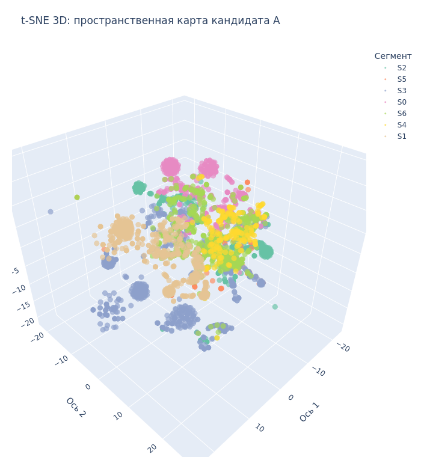

# Откуда модель: рабочий проект (обезличенно)

Модель для NBO взята из моего рабочего проекта. Перед финальным заданием я на работе построил слой клиентской аналитики на реальных данных. NBO стоит поверх него.

Здесь коротко: что за слой, цели, как делил клиентов, что вышло. Все обезличено: без названия компании, без ИНН, без реальных имен продуктов. Сегменты - коды `S0..S6`, продукты в публичной версии - `PROD_xx`.

Слой состоит из двух проектов: сегментация клиентов и субсегментация. NBO использует их выход как признак.

---

## 1. Сегментация клиентов

Задача: разбить базу юрлиц по поведению на несколько устойчивых групп. Группа - единица для аналитики и адресных продаж.

Клиент - юрлицо, идентификатор - ИНН. В публичной версии ИНН заменен на хэш `client_id`, сам ИНН наружу не выходит.

Признаки, около 950 на клиента, считаются на дату (без утечки будущего):
- активность: давность и частота событий, динамика по кварталам;
- денежный прокси: масштаб активности, без реальных сумм выручки;
- affinity: к каким группам продуктов тяготеет;
- lifecycle: стадия - первая покупка, продление, апгрейд.

Выбор финальной сегментации. Построил несколько вариантов-кандидатов, выбрал по матрице качества: понятность, устойчивость, полезность для бизнеса и другие критерии. Победитель заморожен как рабочий.

Результат:
- 7 сегментов `S0..S6`;
- реестр скорабельности, порядка 13 тыс. клиентов со статусами (кого можно надежно скорить, кого нет);
- поквартальная история сегмента по каждому клиенту;
- объем: сотни тысяч событий за несколько лет.

Распределение по 7 сегментам (доля базы):

Affinity-кластеры раскрываются в 7 финальных сегментов:

Выбор сегментации по матрице качества (кандидаты CAND_A/B/C по критериям):

Клиенты в пространстве признаков, t-SNE 3D, цвет - сегмент `S0..S6`:

Интерактивная версия (можно вращать): [segments_3d.html](upstream/segments_3d.html). ИНН в подсказках замаскированы. Чтобы открыть прямо в браузере с GitHub: [htmlpreview](https://htmlpreview.github.io/?https://github.com/0x39f963/ml_ops_final/blob/master/docs/upstream/segments_3d.html).

---

## 2. Субсегментация

Задача: внутри сегментов выделить под-группы потоньше.

Метод: внутри каждого сегмента `S0..S6` клиенты раскладываются в пространстве признаков (t-SNE) и бьются на под-группы (leaf, до 13).

Статус: уровень проходит внутренний аудит, в прод не выведен. В NBO по умолчанию выключен, используется только сегмент `S0..S6`.

---

## 3. Связь с заданием

Сегмент `S0..S6` идет признаком в модель NBO. История событий и реестр скорабельности используются для построения признаков и для честного `not_scorable` (кого скорить нельзя). NBO - контур поверх готового слоя аналитики.

**Итог:** на работе построил сегментацию клиентской базы (7 сегментов, выбор кандидата по матрице качества, PIT без утечек). В финальном задании закрепил MLOps: завернул поверх этого слоя сервис рекомендаций с полным циклом уровня 2 (обучение, реестр моделей, авто-переобучение с гейтом, сервинг, мониторинг). Реальные данные и визуализации остаются локально, здесь только обезличенные иллюстрации методологии.
