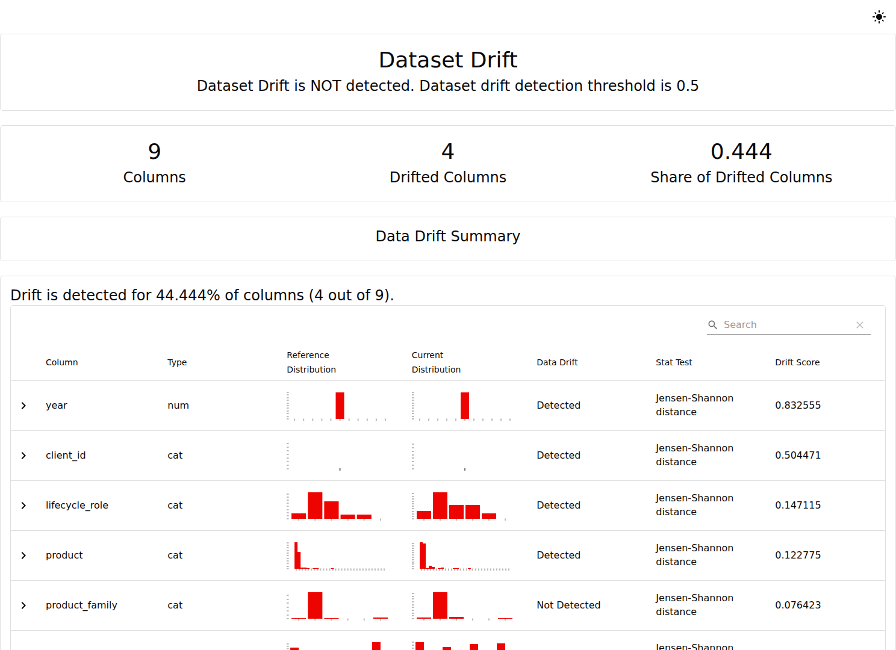
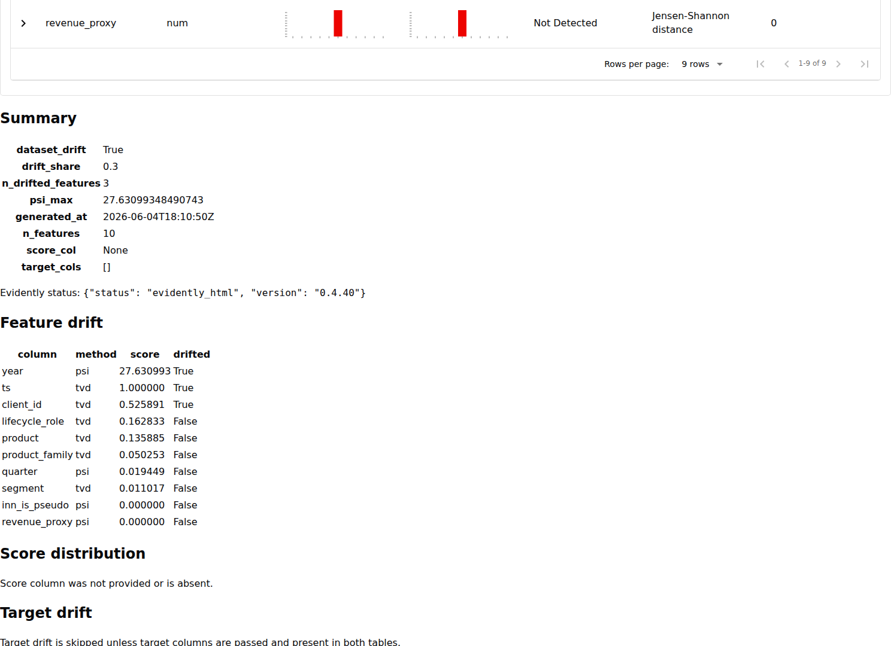
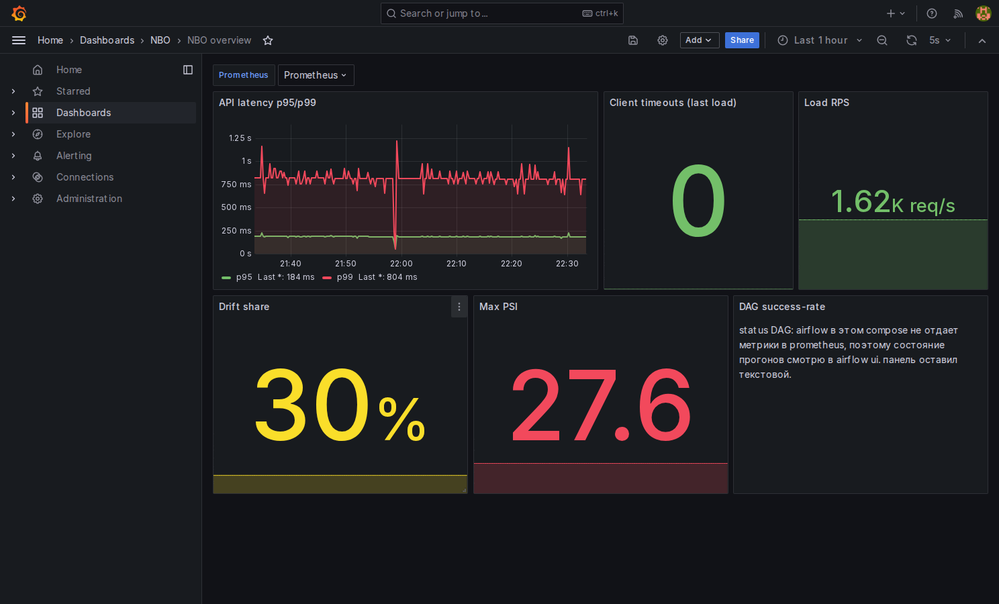
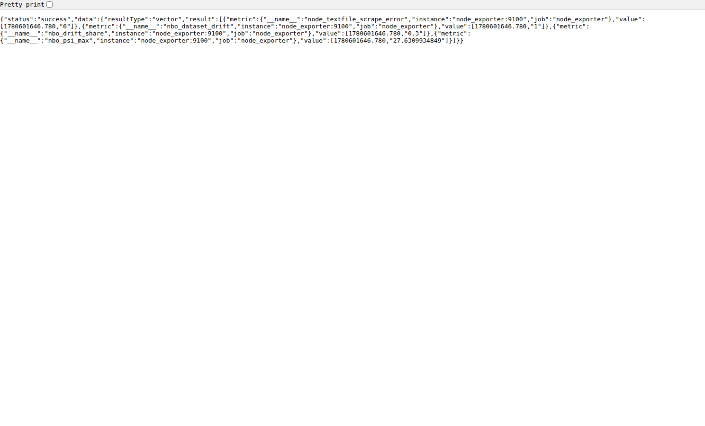

# мониторинг дрифта данных

честно, до этого задания я с дрифтом руками не работал, только читал про него по верхам. поэтому решил прогнать его на своих данных и посмотреть, что получится. ниже - что я сделал и что из этого понял.

## что вообще за дрифт и зачем он мне

идея простая. модель училась на данных одного периода, а в проде на вход идут уже другие данные: со временем клиенты меняются, спрос на продукты гуляет, сезоны разные. если новый поток слишком уехал от того, на чем модель училась, рекомендации начинают потихоньку промахиваться. дрифт и нужен, чтобы заранее это поймать, пока менеджеры не начали жаловаться на странные предложения.

первое впечатление, когда открыл evidently и увидел все эти drift score, psi, tvd, jensen-shannon - голова кругом. метрик много, и сначала непонятно, на что вообще смотреть. поэтому я разложил для себя в два простых уровня.

## два уровня, чтобы не запутаться

1. **картинка для глаз.** evidently строит html, где по каждому столбцу видно два распределения рядом - опорное и текущее - и подписано, сдвинулось оно или нет. открыл, прокрутил, понял, где разница.
2. **числа для мониторинга.** поверх этого моя обертка `monitoring/evidently/drift_report.py` сводит все к трем коротким числам и кладет их в prometheus, а grafana рисует их на дашборде рядом с latency и нагрузкой. так дрифт виден в общем мониторинге сервиса.

три числа, которые я в итоге смотрю:
- `drift_share` - какая доля столбцов заметно сдвинулась;
- `dataset_drift` - флаг "в целом поехало" (включается с порога 0.20);
- `psi_max` - насколько сильно уехал самый "уехавший" столбец.

## сначала прогнал контрольный запуск

чтобы понять, что отчет честный, сравнил синтетический файл сам с собой. дрифта ноль, все столбцы совпали. данные-то одинаковые. зато стало видно, что пайплайн собирается и отчет открывается.

## потом - на реальных (обезличенных) данных

тут самое интересное. взял обезличенную проекцию реальных событий и разрезал по времени: опорный период - 2024 год, текущий - 2025. и прогнал дрифт между ними.

evidently показал, что из 9 столбцов сдвинулись 4. при этом сверху написано `Dataset Drift is NOT detected` - сначала меня это смутило. оказалось, у evidently свой порог: общий флаг он включает, только если уехало больше половины столбцов (4 из 9 - это 0.44, меньше 0.5). то есть отдельные столбцы поехали, а общий флаг по его логике еще нет. обе фразы верные, просто про разное.

моя обертка считает чуть иначе - по всем 10 публичным столбцам и со своим порогом 0.20:

тут вышло: `drift_share = 0.3` (сдвинулись 3 столбца из 10), флаг `dataset_drift = 1`, `psi_max = 27.6`.

## что именно поехало и как я это читаю

- **год и дата события** - уехали сильнее всего, и это понятно: я же сам сравнивал 2024 с 2025, время обязано отличаться. для меня это была проверка, что разрез по времени реально разнесен по годам.
- **состав клиентов** (`client_id`) - тоже сдвинулся. в 2025 активны другие клиенты, чем в 2024: кто-то пришел, кто-то ушел. вот это уже важный сигнал: если поток клиентов поменялся, модель может хуже попадать, и ее стоит переобучить.
- **продукты, сегменты, роли клиентов** - почти не сдвинулись, остались ниже порога. структура спроса и базы между годами держится.

меня поначалу пугало большое `psi_max = 27.6` - думал, что-то сломалось. потом разобрался: это psi по столбцу `year`, а он и должен быть огромным, раз годы разные. так что само по себе большое psi - еще не беда, надо смотреть, по какому оно столбцу.

## как это попало в мониторинг

три числа уходят в prometheus, и grafana показывает их на дашборде `nbo_overview` рядом с нагрузкой:

`Drift share` загорелся желтым на 30%, `Max PSI` - красным на 27.6 (пороги панелей: желтый от 0.2, красный выше). то есть мониторинг реально среагировал на сдвиг данных.

и чтобы убедиться, что это не только картинка в html, заглянул в сам prometheus - метрики там есть:

`nbo_drift_share = 0.3`, `nbo_dataset_drift = 1`, `nbo_psi_max = 27.63`, `node_textfile_scrape_error = 0` (значит файл с метриками прочитался без ошибок).

## что я из этого вынес

- дрифт оказался обычным сравнением распределений двух периодов, безо всякой магии;
- одно большое число (как psi 27.6) само по себе ни о чем не говорит, важно по какому оно столбцу;
- самый полезный для NBO сигнал тут - сдвиг состава клиентов; сдвиг по времени я в расчет не беру, он искусственный;
- и главное - дрифт теперь встроен в живой мониторинг, видно прямо на дашборде рядом с latency.

это показатель входных данных. качество самих рекомендаций (precision@10, hit-rate@10) считаю отдельно, в [metric_report.md](metric_report.md).

## про данные

реальный отчет построен на обезличенной проекции: вместо настоящих ИНН - хэши `client_id`, вместо названий продуктов - коды `PROD_xx`, сегменты - `SEG_x`. сам html-отчет и реальные таблицы держу локально, в публичную часть идут имена столбцов и числа.
