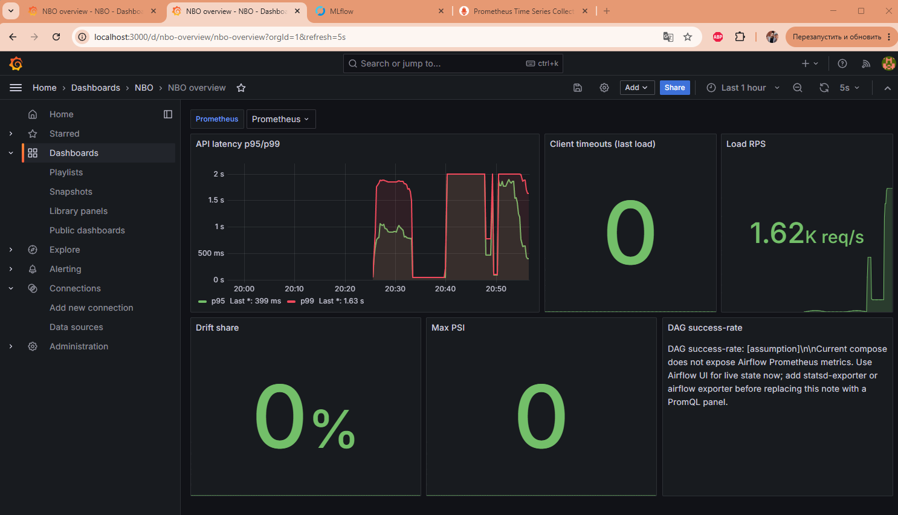

# нагрузочный тест scoring api

прогнал нагрузку на сервис, чтобы понять, сколько запросов в секунду он держит и укладывается ли в slo по времени ответа (p95 `/score` < 500 мс). качество рекомендаций тут ни при чем, его смотрю отдельно в [metric_report.md](metric_report.md).

## сценарий

на проде это выглядит так: менеджеры в crm открывают карточки клиентов и просят топ-10 предложений. главное для них - чтобы ответ пришел быстро. поэтому лил нагрузку на `POST /score` (топ-10 по клиенту); batch-режим в этот тест не брал, он про массовый расчет.

## как нагружал

нагрузку гнал небольшим скриптом: он шлет пачку параллельных запросов и сам считает rps, коды ответов, таймауты и latency (avg/p95/p99). свои числа скрипт пишет в textfile, его читает node_exporter, и метрики нагрузчика видно в grafana рядом с метриками сервиса.

таймауты считаю на стороне клиента специально: server-side `/metrics` их не ловит. если клиент не дождался ответа и оборвал соединение, на сервере это далеко не всегда становится ошибкой 5xx.

api подняли в docker-compose на 12 uvicorn-воркерах. на одном воркере 12-ядерная машина простаивала, с 12 запросы реально пошли параллельно: cpu в пике ~360%, память ~5.5 гб (модель грузится в каждый воркер). reference_date взял 2024Q4 - под него уже лежит готовая партиция фич, поэтому latency меряет сам сервинг, без расчета фич в момент запроса.

## результат

финальный прогон - 50000 запросов `POST /score`:

```text
requests_total=50000
requests_per_second=1623.70
status_counts={"200": 50000}
transport_failures=0
latency_avg_seconds=0.1480
latency_p95_seconds=0.2893
latency_p99_seconds=0.3725
```

| метрика | значение |
|---|---:|
| запросов | 50000 |
| ответов 200 | 50000 (100%) |
| таймаутов | 0 |
| rps | 1623.7 |
| avg latency | 148 мс |
| p95 latency | 289 мс |
| p99 latency | 372 мс |

все 50000 ответили 200, ни одного таймаута, p95 289 мс - в целевые полсекунды укладываемся с запасом, throughput около 1.6k rps.

## как искал узкое место

до финальной цифры было несколько прогонов, они и помогли понять, где затык:

- на одном воркере, со смешанными эндпоинтами и batch: из 5000 запросов 319 отвалились по таймауту, средняя latency ~2.5 с. затык - один воркер.
- 12 воркеров, только `/score`: таймауты ушли, p95 0.475 с, ~717 rps.
- 12 воркеров, упор в `/batch-score`: http rps падает до ~160. это ожидаемо - в одном batch-запросе скорятся десятки клиентов сразу, работы на запрос больше. для online-latency смотрю одиночный `/score`, batch отношу к ночному массовому расчету.

## grafana

на дашборде `nbo_overview` (`http://localhost:3000/d/nbo-overview`) после прогона видно: `Load RPS` ~1.62k, `Client timeouts` 0, latency p95/p99 поднимается под нагрузкой, drift и psi по нулям.



по панели latency есть один момент: server-side p99 на графике выше, чем p99 у нагрузчика. grafana считает квантили по гистограмме за 5-минутное окно, и туда попали еще и более тяжелые предыдущие прогоны с batch. поэтому итоговый throughput беру из чисел нагрузчика, а панель сервиса использую как подтверждение, что latency отслеживается и реагирует на нагрузку.

## итог

сервис держит online-нагрузку на одиночном скоринге: около 1.6k rps, p95 в slo, без таймаутов. рост воркеров с одного до 12 поднял throughput с сотен запросов до 1.6k. заодно проверил, что мониторинг ловит и нормальную, и кривую нагрузку: при плохом профиле (один воркер, batch на лету) latency и таймауты сразу видно на графиках.

прогон локальный, на одной машине, так что это потолок такой конфигурации. под реальной сетью операторов цифры будут другими, но для проверки, что сервинг укладывается в технический slo по latency, этого хватает.

## ссылки

- сервис: [src/serve_api.py](../src/serve_api.py)
- воркеры в compose: [docker-compose.yml](../docker-compose.yml)
- дашборд: [monitoring/grafana/dashboards/nbo_overview.json](../monitoring/grafana/dashboards/nbo_overview.json)
- пороги slo: [docs/sli_slo.md](../docs/sli_slo.md)
