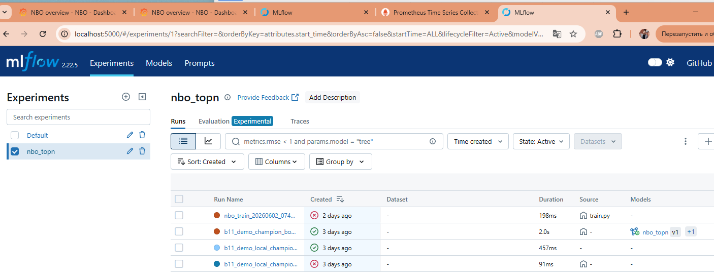
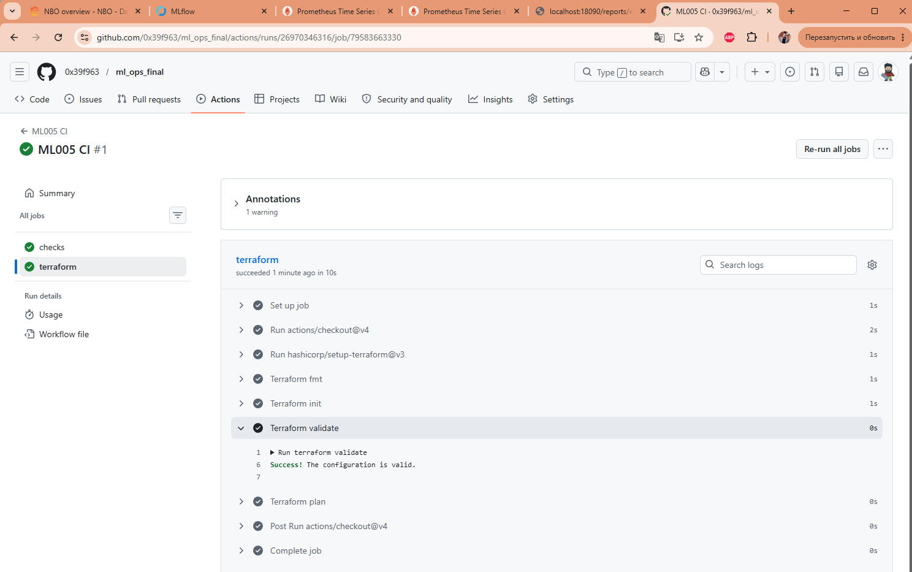
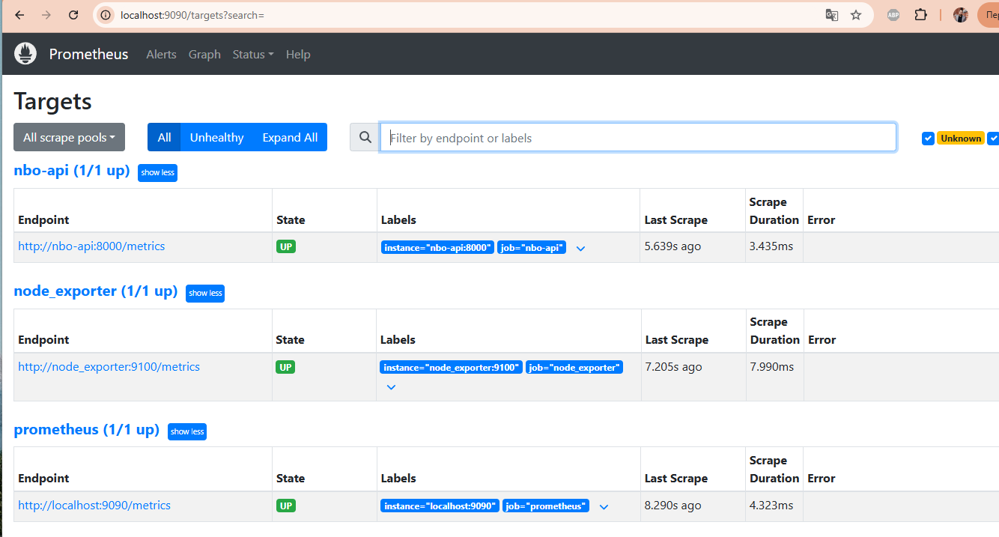

# Скриншоты: локальный запуск всех частей системы

Кадры сняты на localhost. В кадре только публичные имена: `client_id`-хэш, `PROD_xx`, `SEG_x` (без реальных ИНН и названия компании).

В скобках у каждого - критерий оценки, который кадр подтверждает (C1 цель, C2 зрелость Level 2, C3 создание/работа сервиса, C4 риски, C5 MDD).

---

## Сервис и продукт

### Контракт scoring-API (C1)
Эндпоинты сервиса: `/health`, `/score`, `/batch-score`, `/model-info`, `/metrics`.

### Demo: топ-10 по клиенту (C1)
Вводим клиента - получаем топ-10 продуктов с вероятностью. Режим `inn`: реальный ИНН хэшируется прямо в браузере, в API уходит только `client_id`-хэш.

### `/health` -> 200 (C3)
Сервис жив, модель загружена по alias `champion`.

---

## Зрелость Level 2: переобучение и переключение модели

### Airflow DAG переобучения (C2)
Конвейер `nbo_retrain_pipeline`.

### Прогон DAG со всеми задачами (C2)
Видны все задачи, включая ветку `compare_with_champion -> register_model / skip_deploy` (автоматический вывод плохой модели через переключение трафика).

### Эксперименты и модель в MLflow (C2)
Эксперимент `nbo_topn`: прогоны обучения и зарегистрированная модель `nbo_topn` версии 1. Версионирование и переключение champion/challenger идет через alias.

---

## Инфраструктура

### docker ps - сервисы Up(healthy) (C3)
Весь стек поднят одной командой, у сервисов healthcheck.

### docker stats - сервисы под нагрузкой (C3)
Потребление ресурсов: контейнеры NBO (в красной рамке) живые и работают.

### CI зеленый (C3)
GitHub Actions: job checks (компиляция + смоук-тесты) и job terraform (fmt / validate / plan).

---

## Мониторинг

### Prometheus targets UP (C4)
Все таргеты подняты: `nbo-api`, `node_exporter`, `prometheus`.

### Grafana NBO overview под нагрузкой (C4)
Дашборд после нагрузочного теста: `Load RPS` ~1.62k, `Client timeouts` 0, latency p95/p99 реагирует на нагрузку, `Drift share` 0% / `Max PSI` 0. Полный разбор - в отчете [reports/load_test.md](../reports/load_test.md): 50000 запросов `POST /score`, 0 таймаутов, p95 289 мс (slo p95 < 500 мс).

---

Полный каталог evidence (включая текстовые логи) - в [INDEX.md](INDEX.md).
